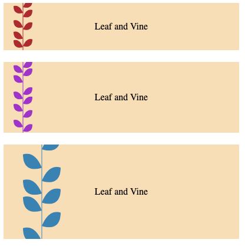

# houdini-leaf

[Demo](https://codepen.io/zhua/pen/LYRxxJK)



Import the script
```html
<script src="https://unpkg.com/houdini-leaf"></script>
```

Default settings
```css
.my-element {
    --leaf-color: black;
    --leaf-size: 16;
    background-image: paint(leaf);
}
```