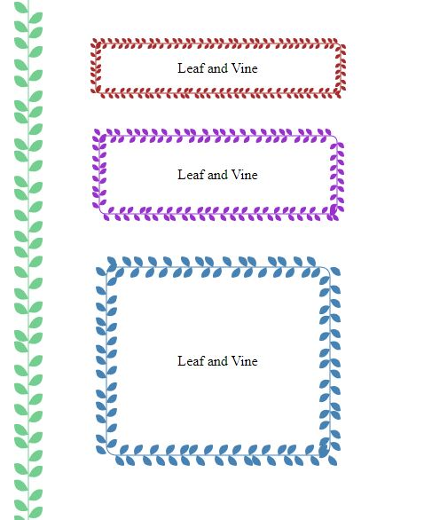

# houdini-leaf

[Demo](https://codepen.io/zhua/pen/LYRxxJK)



Import the script
From package
```
npm install houdini-leaf
```
Automatic worklet module loading
```html
<script src="node_modules/houdini-leaf/houdini-leaf.js"></script>
```
Or load worklet manually
```js
CSS.paintWorklet.addModule('node_modules/houdini-leaf/worklet.js');
```
From CDN
```html
<script src="https://unpkg.com/houdini-leaf"></script>
```

Default settings
```css
.my-element {
    --leaf-color: #73CE8F;
    --leaf-size: 16;
    --leaf-variance: left;
    background-image: paint(leaf);
}
```