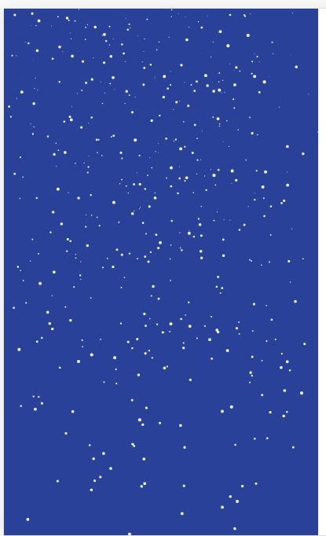

# houdini-snowflake
**Experiment - Failed**

This POC suffers performance bottleneck when the canvas output image to be used as the background-image. 
Different from using canvas as background there animation never needs to be interrupted when the image is never
exported, hence there is always a buffer between the first paint and the next paint. When using the
`background-image` property with houdini paint API, the old image is removed before the next image is applied,
There is always a gap. When the canvas is big enough, the speed to export the image becomes the bottleneck which
causes the gap even longer until the next paint is exported.

[comment]: <> ([Demo]&#40;codepen&#41;)



[comment]: <> (Import the script)

[comment]: <> (```html)

[comment]: <> (<script src="https://unpkg.com/houdini-snowflake"></script>)

[comment]: <> (```)

[comment]: <> (Default settings)

[comment]: <> (```css)

[comment]: <> (.my-element {)

[comment]: <> (    background-image: paint&#40;snowflake&#41;;)

[comment]: <> (})

[comment]: <> (```)

## Credit

The algorithm is adapted from 
[Aatish Bhatia's Snow Globe Experiment](https://aatishb.com/experiments/snowglobe/).